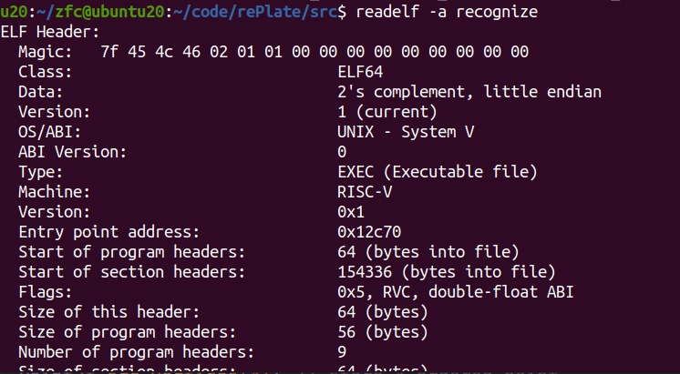
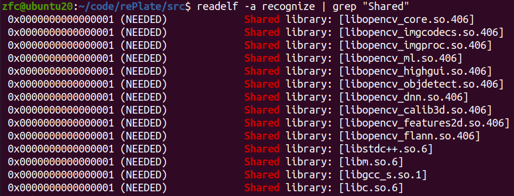

### 查看ELF文件

在linux中可以使用`file`命令查看文件格式，但在做c/c++开发时，我们通过生成一个可执行的ELF文件来执行程序，这个时候如果想看这个ELF文件的具体信息，就需要用另一个命令`readelf -a elf_file`，该命令会返回elf文件的所有结构信息：

但以此获得的信息太多，一时难以找到我们需要的信息，比如我们只需要关注该ELF文件关联了几个动态库，我们就可以用`readelf -a elf_file | grep "Shared"`，如下：

