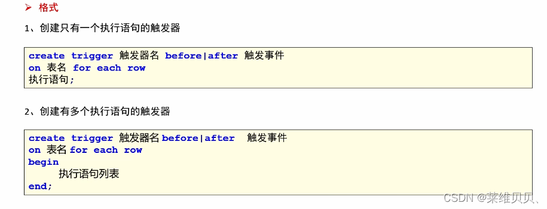
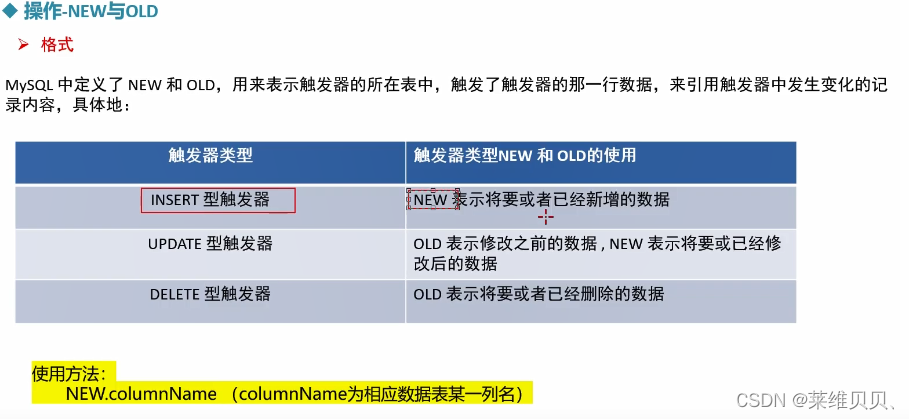

### 触发器

数据库的增删改是常见的操作，但有些时候，我们想在增删改的操作前后自动的执行一些动作，比如，我现在往表A中插入一条数据，同时希望这条数据自动同步到表B中，类似这种需求，就可以使用触发器来实现

#### 1.  特性

触发器有几个关键的特性：

1.  触发条件：增删改
2.  触发时间：增删改前或者后
3.  触发频率：针对每一行执行
4.  触发器定义在表上，附着于表上

#### 2.  创建

#### 3.  类型

