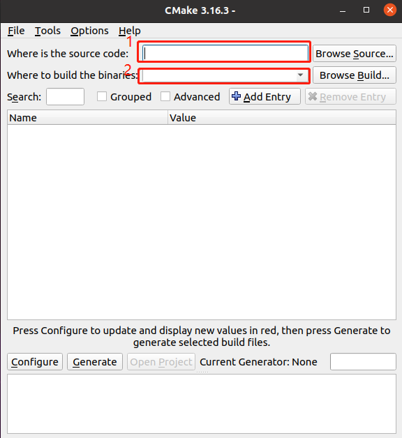
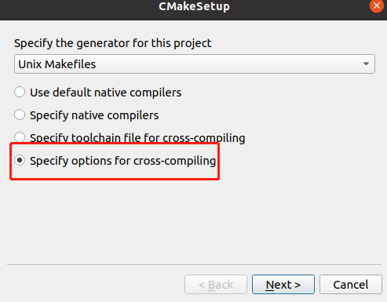
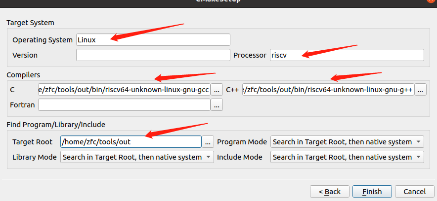
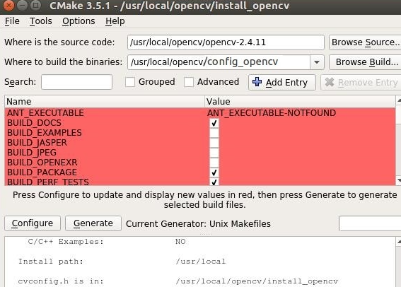
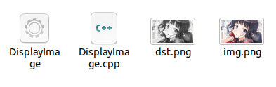

### 移植OpenCV

#### 1.  介绍

OpenCV的应用非常广泛，包括但不限于：

- 增强现实
- 人脸识别
- 手势识别
- 人机交互
- 动作识别
- 运动跟踪
- 物体识别
- 图形分割

在x86-Linux系统下，如果使用python模块化的方式安装opencv非常简单（直接使用`pip install opencv-python==<VERSION>`），但简易的代价就是无法对opencv进行更改，例如任意删除组件来减少空间，定制化修改，指定安装路径等等，尤其是在移植的情况下，我们只能选择源码编译。

#### 2.  工具

在这里需要准备好riscv交叉编译工具链、64位的qemu以及cmake-gui

安装cmake-gui可使用如下命令（ubuntu）：

```shell
sudo apt install cmake-gui
```

启动cmake-gui直接命令`sudo cmake-gui`即可

#### 3.  依赖

首先从官网下载opencv的源码

```shell
git clone https://github.com/opencv/opencv.git
```

我们默认在/usr/local目录下来进行opencv的移植操作：

```shell
# 新建主工作目录
cd /usr/local && mkdir opencv-rsicv
# 分别创建两个空目录：build用于编译，install用于安装
cd opencv-riscv
mkdir build
mkdir install
# 接着将下载好的opencv源码移至/usr/local/opencv-riscv目录下
# 此时opencv-riscv目录下存在3个子目录：build  install  opencv
```

新建好这些目录后，直接启动cmake-gui，界面如下：



红框框住的部分，在 <font color=red>1</font> 处我们填入源码的位置，我们这里是/usr/local/opencv-riscv/opencv，在 <font color=red>2</font> 的位置我们需要填入编译的工作路径，这里我们填入的是/usr/local/opencv-riscv/build

完成这些后，需要点击左下角的Configure按钮，选择交叉编译如下：




紧接着，需要对如下选项进行设置：



注意：Operating System一定要写Linux，这里是区分大小写的，处理器选择riscv

Compilers选项中的C和C++对应选择交叉编译工具链中的可执行文件，Target Root我们需要填入的是工具链的路径，如我们在这里填写的/home/zfc/tools/out，然后点击Finish完成

完成这些后，紧接着需要设置一些依赖选项，如下图中的红色部分（这里忘了截图，随便贴的一个网图），这部分尤为关键，你程序需要使用什么样的功能，或者你需要哪些依赖模块的支持，直接使能它就好，如果不知道每个模块的含义，无从下手，那就什么都不要动，接着文章的指引往下走即可。



我们在这里只需要做一些基本的修改，打开Advanced选项（位于红色部分的上面一行）：

- `CMAKE_BUILD_TYPE` 设置为Release
- `CMAKE_EXE_LINKER_FLAGS` 设置为 -lrt -pthread
- `CMAKE_INSTALL_PREFIX ` 这个选项是选择安装位置，还记得我们之前新建的install目录吗，我们将这里设置为/usr/local/opencv-riscv/install

完成这些，再次点击Configure即可完成依赖的添加

#### 4.  编译

完成上述步骤没有问题后，接下来的操作就很简单了，直接make即可：

```shell
# 回到build目录，编译的操作都在这里完成
cd /usr/local/opencv-riscv/build
sudo make -j$(grep -c ^processor /proc/cpuinfo)
sudo make install
```

到这里，编译过程就全部结束了

#### 5.  测试

测试之前，需要对环境变量进行设置，不然最后执行的时候可能找不到动态库：

```shell
export LD_LIBRARY_PATH="/usr/local/opencv-riscv/install/lib:$LD_LIBRARY_PATH"
```

下面是一段测试代码（DisplayImage.cpp）：

```c++
#include <stdio.h>
#include <opencv2/opencv.hpp>
#include "opencv2/imgproc/imgproc.hpp"
#include "opencv2/imgproc/types_c.h"
using namespace cv;

//将图片灰度化并保存
int main()
{
	Mat image;
	image = imread("./img.png");
	if(!image.data)
	{
		printf("No image data \n");
		return -1;
	}else{
		printf("read the image!\n");
	}
	Mat dst;
	cvtColor(image,dst,CV_BGR2GRAY);
	imwrite("dst.png", dst);
	printf("change success!\n");
	return 0;
}
```

**编译命令：**

```shell
riscv64-unknown-linux-gnu-g++ DisplayImage.cpp -o DisplayImage -I /usr/local/opencv-riscv/install/include/opencv4 -L /usr/local/opencv-riscv/install/lib -lopencv_core -lopencv_imgcodecs -lopencv_imgproc
```

**运行：**

```shell
qemu-riscv64 -L ~/tools/out/sysroot DisplayImage
```

**运行结果：**

生成了灰度图，如下：



结束！